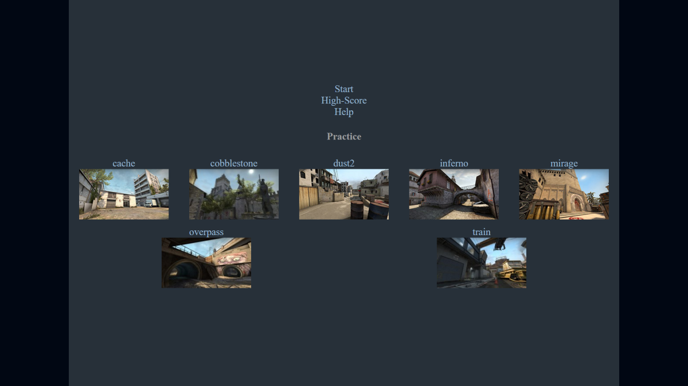
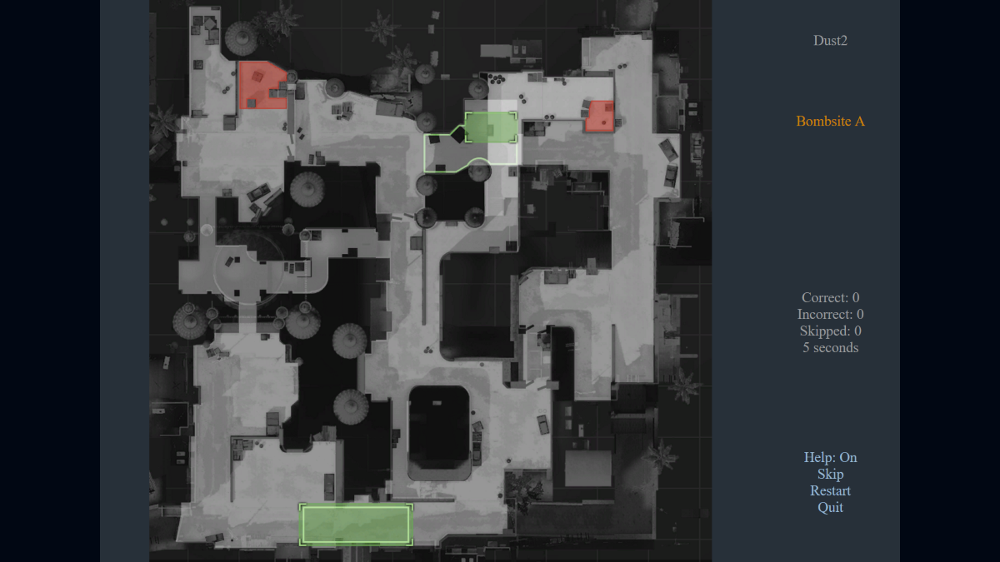

# Info #

A counter-strike mini-game, where you need to choose the correct spot of the map.
The spot names used are the official names that the game recognizes.

In the normal mode, you get a random map, and go through all the spots in the map (in random order as well), until you get them all right. Same thing for the remaining maps until you go through all. You'll have a score that is dependent in the number of correct/incorrect choices, skipped spots, and the time it took to finish all maps.

In practice mode, you select a specific map and play through all the spots. There's no end to it, since its just to practice.

Start with the practice mode to get used to the spot names before trying your luck in the normal mode!

You can try it out here:

- [http://nbpt.eu/games/cs_spot_names/](http://nbpt.eu/games/cs_spot_names/)
- [https://chrome.google.com/webstore/detail/cs-spot-names/bbpbcljfigkeocfjnhdfhibfijoedaon](https://chrome.google.com/webstore/detail/cs-spot-names/bbpbcljfigkeocfjnhdfhibfijoedaon)

# Maps available #

- cache
- cobblestone
- dust2
- inferno
- mirage
- overpass
- train

# Add New Maps #

- The minimap images are located at `/Steam/steamapps/common/Counter-Strike Global Offensive/csgo/resource/overviews` (need to convert the `.dds` file to `.png`).
- The main menu images are located at `/Steam/steamapps/common/Counter-Strike Global Offensive/csgo/maps` (resize it to 200x113 pixels).
- Create a `SVG` file with the map parts (check existing map files for help).
- The color used by each spot path is (from 0 to 255).
    - red: `3`
    - green: `127`
    - blue: `246`
    - alpha: `86`
- Need to add a `.Spot` class and a `displayName` property to each map spot (in `inkscape` it can be done through the XML editor - `Edit -> XML Editor`).
- Save as optimized SVG when done (to remove comments/editor properties/etc).

# Build #

- `tsc -w` : Compile the typescript files (for development).
- `npm install` : Install the build dependencies.
- `grunt` : Run the build script.

# Images #

The images are taken from the cs:go game.

# Libraries #

- [utilities](https://bitbucket.org/drk4/javascript_utilities) : 1.9
